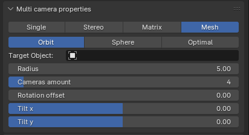
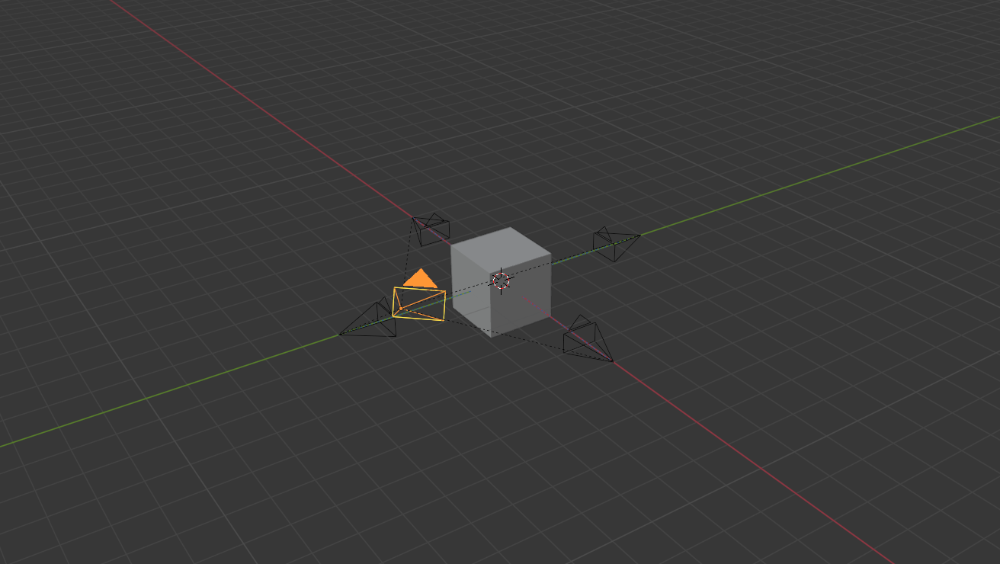
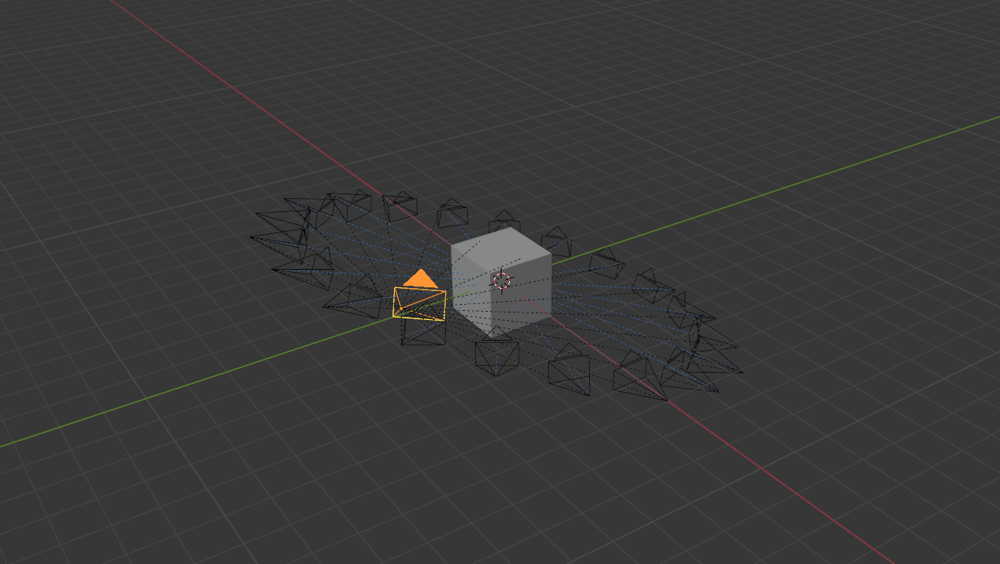
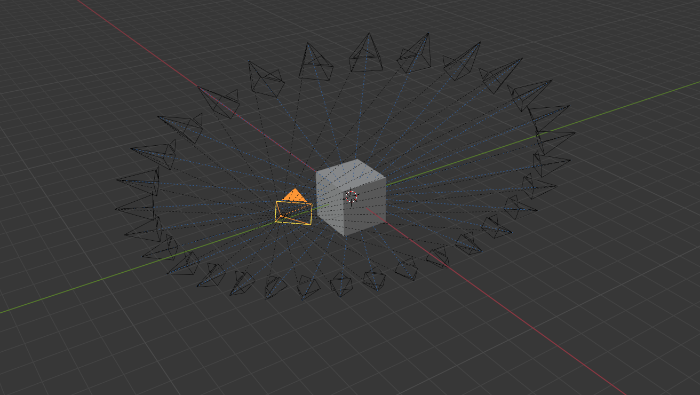
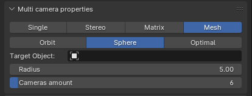
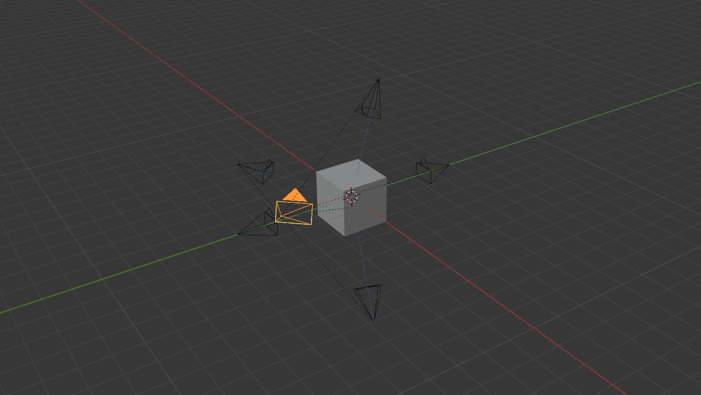
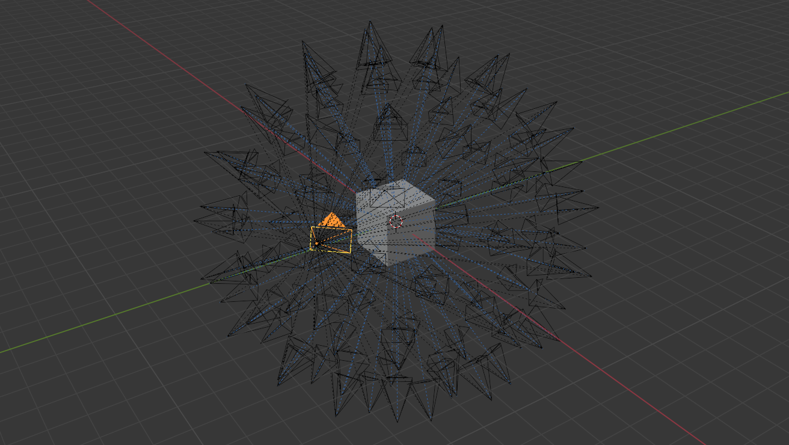
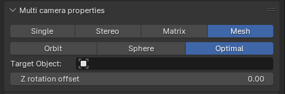
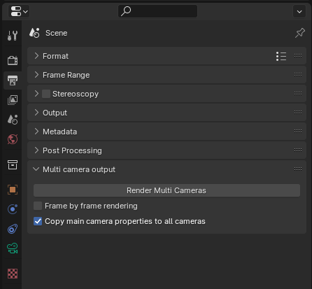

# Blender Multi Camera Rendering Plugin

## Authors
* Paweł Müller ([@pawelmuller](https://github.com/pawelmuller))
* Bartłomiej Piktel ([@bpiktel](https://github.com/bpiktel))
* Grzegorz Rusinek ([@Kszesiek](https://github.com/Kszesiek))

## Installation

In order to use the plugin in Blender you need to install it.

In Blender, head to `Edit` > `Preferences...` > `Add-ons` and click `Install` in the upper right corner of the window.

Now find the plugin file in the files tree and click `Install Add-on`.
Make sure to enable it by checking the box next to the add-on name on the list.

You're set to work with the plugin! Enjoy!

## Plugin features walkthrough

In order to reach the features added by the plugin select a camera and head to `Data` section of its properties.
You'll see `Multi camera properties` tab with four buttons, which allow to switch between different camera modes.

### Single camera

This one is just a basic Blender camera you know and love.
Its main use is to revoke all the changes made in different modes.

### Stereo camera

The stereo mode creates two sub-cameras based on the main camera you've chosen earlier.

In default configuration they face the same direction as the base camera.
You can decide how far away from each other the cameras are by manipulating the `Cameras spacing` attribute.

In the picture above the spacing is set to default 20 units.

In the picture above the spacing is set to 200 units.

There is a possibility to make the camera axis converge, by checking the `Convergent` box.
Now you'll see additional attribute - `Zero parallax`.
It determines how far from the base camera the stereo cameras' axis converge.

In the picture above both the spacing and zero parallax are set to 200 units.

In the picture above the spacing is set to 200 units, but parallax has been changed to 600.

### Matrix camera

Another mode available in the plugin is the matrix mode.
It allows to create a matrix of parallel sub-cameras, based on the selected camera.

You can decide:
* how many cameras are there in each direction (`Vertical amount` and `Horizontal amount` parameters).
* how far away are the cameras from each other (`Vertical distance` and `Horizontal distance` parameters).

_⚠️ Note that the matrix will be built upwards and to the right from the base camera (when looking from behind it)._

In the picture above the amount and distance parameters were set to (3, 3) and (100, 100) respectively.

In the picture above the amount and distance parameters were set to (3, 3) and (200, 300) respectively.

In the picture above the amount and distance parameters were set to (5, 7) and (100, 100) respectively.

#### [Light field camera](https://en.wikipedia.org/wiki/Light_field_camera)

If you want to achieve the light field camera effect you should set the distance attributes to small values.

In the picture above the amount and distance parameters were set to (15, 15) and (20, 20) respectively.

### Mesh camera

The mesh mode comes in 3 variants.

#### Orbit mode

The orbit mode of mesh camera allows you to surround chosen object with a ring of cameras.
You can determine the radius of the ring, amount of cameras and rotation offset.
Additionally, the whole setup can be tilted along x or y-axis.

In the picture above the parameters were set to: radius - 5, cameras - 4, offset - 0, tilt - (0, 0).

In the picture above the parameters were set to: radius - 7, cameras - 20, offset - 0, tilt - (-20, 0).

In the picture above the parameters were set to: radius - 9, cameras - 30, offset - 0, tilt - (-20, -60).

#### Sphere mode

The sphere mode allows to enclose the object with a sphere of cameras.
You can change the `Radius` and `Cameras amount` parameters.

In the picture above the radius was set to 5 while there were 6 cameras.

In the picture above the radius was set to 7 while there were 100 cameras.

#### Optimal mode

This mode tries to optimise the position of the cameras to picture the whole object in each of the 6 cameras.
You can change the rotation offset along z-axis to meet your preferences.

### Rendering

You can find the rendering options in the `Output` tab of camera properties.

| `Frame by frame rendering` | Behaviour                                                           |
|----------------------------|---------------------------------------------------------------------|
| True                       | Renders each frame for each camera, then proceeds to the next frame |
| False                      | Renders all frames for a camera, then proceeds to the next camera   |

When `Copy main camera properties to all cameras` is checked, it does exactly what the name suggests.
